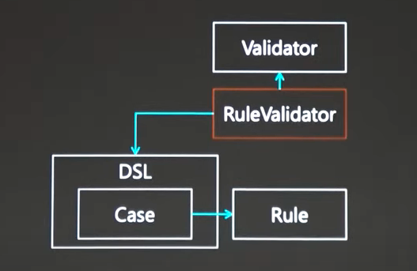

# 도메인 특화 언어 (Domain-Specific Language, DSL)

도메인 특화 언어는 특정 기능이나 영역을 위해 만들어진 언어를 말한다. (직접 만들어보기 전까지는 잘 이해가 안됨.) 

- 소프트웨어 설정 묘사
- 테스트 명세 지정
- 작업 흐름 규칙 정의 
- 데이터 조작 
- UI 설계

**DSL 의 장점은 단순함인데. 문제를 해결할 때 문제가 속한 용여로 기술 할 수 있다는 점이다.**

여기서는 DSL 을 설계할 때 코틀린을 어떻게 쓰면 되는지를 소개한다. 

배우는 내용은 다음과 같다. 

- 연산자 오버로딩 

- 위임 프로퍼티 

- 고차 함수와 DSL 

## 연산자 오버로딩 

**연산자 오버로딩은 `+, -, *, /` 등의 코틀린 내장 연산자에 대해서 새로운 의미부여를 할 수 있는 언어 기능이다.** 

예로 `+` 를 보면 `+` 는 숫자 앞에서는 수 두 개를 더하는 연산이지만, 문자열 연산에서는 연결을 뜻하는 연산이고 컬렉션에서는 원소를 맨 뒤에 붙이는 연산이다.

이렇게 하나의 연산이 다양한 의미를 가질 수 있도록 하는게 `+` 가 오버로딩 되어있기 떄문이다.

**코틀린에서 연산자 오버로딩을 적용하고 싶다면 멤버 함수나 확장 함수에 `operator` 를 붙이면 된다.**

```kotlin
operator fun String.times(n: Int) = repeat(n)
```

- `times` 라는 함수는 연산자 `*` 에 해당하고 이를 확장함수로 정의했다. 

- (연산자에 해당하는 함수 이름을 알아둬야 할 듯.)

**함수를 쓰는 대신에 연산자를 쓰는 경우가 있을 거 같은데 좀 더 직관성이 있어 보인다면 연산자를 정의해서 써보는게 좋은듯.**

- `next()` 라는 함수 호출 대신에 `++` 연산자 를 쓴다던지. 

- (함수 자체가 직관적이라면 연산자를 안쓰지 않을까? `contains()` 의 연산자는 `a in b` 이런식으로 표현되는데 `contains` 자체가 가독성이 좋아서 안쓸듯.`operator` 키워드 없이 그냥 `contains` 자체 메소드를 재정의하는 것도 가능하고)  

**또 다른 이유로는 연산자가 제공해주는 개념을 다양한 곳에서 쓰고 싶을 때 연산자 오버로딩을 사용할 수 있을 것 같다.** 

- `Boolean` 만 되는 논리 연산자를 `Predicate` 레벨로 옮긴다던지. (= `and`, `or`, `not`)


### 단항 연산 

오버로딩 할 수 있는 단항 연산들을 보자. 이걸로는 `전위 +, -, !` 가 있다. 

**단항 연산자는 아무 파라미터도 받지 않고 함수 반환 타입이 단항 연산의 반환 타입이 되는 걸 말한다.**

**컴파일러는 이러한 단항 연산자를 적절한 함수 호출로 변환해준다. 우리는 이 함수를 `operator` 를 통해서 재정의해주면 된다.**

- `+e` 는 `e.unaryPlus()` 로 변경된다. 

- `-e` 는 `e.unaryMinus()` 로 변견된다. 

- `!e` 는 `e.not()` 으로 변경된다.

`not` 연산을 재정의 하는 예제로는 보색 관계를 표현하는 것이 있다.

```kotlin
enum class Color {
    BLACK, RED, GREEN, BLUE, YELLOW, CYAN, MAGENTA, WHITE;
    
    operator fun not() = when (this) {
        BLACK -> WHITE
        RED -> CYAN
        GREEN -> MAGENTA
        BLUE -> YELLOW
        WHITE -> BLACK
        CYAN -> RED
        MAGENTA -> GREEN
        YELLOW -> BLUE
    }
}
```

또 다른 예제로는 `not` 을 제네릭을 포함한 확장 함수로 정의함으로써 어떠한 타입이 올 수 있도록 하는 연산을 제공해주는 것도 가능하다. 

```kotlin
fun isShort(s: String) = s.length <= 4 

fun main() {
    val data = listOf("abc", "abcde", "abcd", "abcdef", "ab")
    
    println(data.count(::isShort))
    println(data.count(!::isShort))
}

operator fun <T> ((T) -> Boolean).not(): (T) -> Boolean = { !this(it)}
```

- 어떠한 타입의 함수 호출에 대한 `not` 연산자를 정의한 것. 
- `(T) -> Boolean` 이 T 타입에 대한 함수 호출을 말하고 반환 값이 Boolean 이라는 걸 말한다.
- `((T) -> Boolean).not()` 이 T 타입에 대한 함수 호출에 대한 `not()` 연산을 정의한 걸 말한다. 
- 반환 티입이 `(T) -> Boolean` 인 것은 `count()` 가 `predicate` 타입을 받기 떄문에 함수 형식으로 반환을 해줘야한다. 
- `this()` 는 함수 호출을 말하고 `it` 는 이 함수 호출의 인자가 하나이므로 이렇게 표현이 가능하다. 
- **물론 이제 `isShort` 대신에 `isNotShort` 를 정의해서 사용할 수 있는데 이러면 변경 포인트가 두 곳이 될 것.**
- **이 예제 괜찮다고 생각함.**

### 증가와 감소 

증가 (++) 와 감소 (--) 같은 경우도 파라미터가 없는 `inc()` 와 `dec()` 함수로 오버로딩 할 수 있다. 

- 이런 함수의 반환 타입은 항상 증가나 감소 이후에도 같은 타입이어야 한다. 

- **일반적으로 사용할 수 있는 케이스는 `enum` 이 있겠다.**

`++` 와 `--` 를 사용하는 예제를 보자.

```kotlin
enum class RainbowColor {
    RED, ORANGE, YELLOW, GREEN, BLUE, INDIGO, VIOLET; 
    
    operator fun inc() = values[(ordinal + 1) % values.size]
    
    operator fun dec() = values[(ordinal - 1) % values.size]
    
    companion object {
        private val values = enumValues<RainbowColor>()
    }
}
```

### 이항 연산 

코틀린에서는 대부분의 이항 연산자를 오버로딩 할 수 있다. 

- `&&` 나 `||`  는 오버로딩 할 수 없다. 

- 참조 동등성 연산자인 `===` 나 `!==` 도 마찬가지로 오버로딩 할 수 없다.

단한 연산과 마찬가지로 정해진 이름의 연산자 함수를 정의하면 되고 가장 큰차이는 왼쪽 피연산자가 수신 객체가 되고 오른쪽 피연산자가 인자로 들어온다는 점이다.

- `a + b` 의 연산자는 `a.plus(b)` 의 함수 호출로 변환된다. 

- `a - b` 의 연산자는 `a.minus(b)` 의 함수 호출로 변환된다. 

- `a * b` 의 연산자는 `a.times(b)` 의 함수 호출로 변환된다. 

- `a / b` 의 연산자는 `a.div(b)` 의 함수 호출로 변환된다. 

- `a % b` 의 연산자는 `a.rem(b)` 의 함수 호출로 변환된다. 

  - 원래는 나머지 연산이 `mod` 였지만 현재는 `rem` 이 대체한다. 

- `a .. b` 의 연산자는 `a.rangeTo(b)` 의 함수 호출로 변환된다. 

- `a in b` 의 연산자는 `b.contains(a)` 의 함수 호출로 변환된다.

- `a !in b` 의 연산자는 `!b.contains(a)` 의 함수 호출로 변환된다. 

- `a < b` 의 연산자는 `a.compareTo(b) < 0` 의 함수 호출로 변환된다. 

- `a <= b` 의 연산자는 `a.compareTo(b) <= 0` 의 함수 호출로 변환된다. 

- `a > b` 의 연산자는 `a.compareTo(b) > 0` 의 함수 호출로 변환된다. 

- `a >= b` 의 연산자는 `a.compareTo(b) >= 0` 의 함수 호출로 변환된다. 

이런 연산 자체가 필요한 유리수를 만드는 시스템에서는 이런 이항 연산 재정의를 할 것 같다. 

- 각 수를 `sign, num, den` 으로 구별해서 필드로 저장해놓고 계산을 때릴 것이니까. 

## 중위 연산 

중위 연산으로 쓸 수 있는 것 중에서는 `to` 가 있다. 

```kotlin
val pair1 = 1 to 2 
```

중위 호출을 가능하게 하려면 함수 앞에 `infix` 라는 걸 붙여야 한다.

`infix` 가 붙을 수 있는 함수는 파라미터가 하나인 멤버함수나 확장 함수영 ㅑㅎ나다. 

```kotlin
infix fun <A, B> A.to(that: B): Pair<A, B> Pair(this, that)
```

이를 이용하면 논리곱 (conjunction) 과 논리합 (disjunction) 을 표현하는 중위 연산을 정의하는게 가능하다. 

````kotlin
infix fun <T> ((T) -> Boolean).and(other: (T) -> Boolean): (T) -> Boolean = { this(it) && other(it)}

infix fun <T> ((T) -> Boolean).or(other: (T) -> Boolean): (T) -> Boolean = { this(it) || other(it)}
````

이런 연산을 이용하면 좀 더 간결하게 술어를 만들 수 있다. 

````kotlin
fun isShort(s: String) = s.length <= 4

fun String.isUppercase() = all { it.isUpperCase() }
    
fun main() {
    val data = listOf("abc", "abcde", "abcd", "abcdef", "ab")

    println(data.count( ::isShort and String::isUppercase))
}
````

- **`and` 와 `or` 이라는 연산자를 정의해서 술어를 쪼개서 표현하는게 가능하다. 이렇게 안한다면 `isShort()` 와 `isUppercase()` 를 포함한 함수로 만들어야 할 듯.** 
- **원래는 `Boolean` 값만을 `&&` 나 `||` 같은 논리 연산을 적용하는게 가능한데, 연산자를 재정의해서 함수 단위로 이 개념을 표현하도록 헀다는게 신기하네.**


### 대입 

또 다른 이항 연산 그룹으로 `+=` 와 같은 복합 대입 연산이 있다.

- `+=` 을 불변 컬렉션 타입의 변수에 적용하면 새로운 컬렉션 객체가 생기고 이 객체를 변수애 대입해서 변수 값이 바뀐다. 

- 하지만 이를 가변 컬렉션에 넣으면 그냥 요소만 들어가지 컬렉션 객체 자체는 변경되지 않는다. 

- 근데 가변 컬렉션에 가변 변수를 넣으면 데이터가 변경될 가능성이 있기 떄문에 에러가 난다.

`+=` 와 같은 복합 대입 연산자의 해석 방법을 보자. 

- 먼저 커스텀 복합 대입 연산자가 있는지 확인한다. `+=` 같은 경우는 `plussAssign()` 이 있는지 확인한다. 이걸 이용한다. 

- 복합 대입 연산자가 없다면 이행 연산자의 대입을 사용한다. `+=` 같은 경우는 `+` 이행 연산자를 이용한다.  

- 복합 대입 연산자의 왼쪽 피연산자가 불변이라면 일반 대입문과 이항 연산을 활용한 방식을 사용할 수 없다. 

## 호출과 인덱스로 원소 찾기 

필요한 파라미타와 함께 `invoke()` 함수를 정의하면 값을 함수처럼 사용하는게 가능해진다. 

````kotlin
operator fun <K, V> Map<K,V>.invoke(key: K) = get(key)

fun main() {
    val map = mapOf("I" to 1, "V" to 5, "X" to 10)
    
    println(map("I"))
} 
````

`invoke` 와 `companion object` 를 이용해서 팩토리로 만들 수도 있다.

```kotlin
class Rational(val sign: String, val num: Int, val dem: Int) {
    companion object {
        operator fun invoke(num: Int, den: Int = 1) = Rational("+", num, den)
    }
}

fun main() {
    val rational = Rational(1, 2)
} 
```

- 마치 여러개의 생성자를 가지는 것처럼 사용할 수 있다. 

다음으로 인덱스 연산자를 볼 건데 `array[0]` 이렇게 인덱스 요소를 통해서 호출하는 건 연산자 `get()` 이 있기 때문이다. 

그리고 `array[0] = 10` 과 같이 인덱스를 통해 대입을 할 수 있는 건 연산자 `set()` 이 있기 때문이다. 

이를 정의하면 인덱스 요소를 다루는 것 처럼 쓸 수 있다. 

### 구조 분해 

데이터 클래스에서는  한 번에 여러 프로퍼티로 읽어오고 싶을 때 구조 분해를 사용하는게 가능하다. 

구조 분해 기능을 다른데서 사용하고 싶다면 `componentN()` 이라는 함수를 정의해야한다. 

```kotlin
operator fun RationalRange.component1() = from 
operator fun RationalRange.component2() = to 

fun main() {
    val (from, to) = R(1,3)..R(1,2)
}
```

**구조 분해를 이용하면 한번에 여러 값을 뽑아올 수 있으니까 논리적으로 그룹핑할 때 좋겠다.**


### 이터레이션 

for 문을 ㄷ로고싶다면 `iterator` 함수를 `operator` 로 정의하면 된다. 

***

## 위임 프로퍼티 

위임 프로퍼티를 사용하면 간단한 문법 뒤에 커스텀 프로퍼티 접근 로직을 구현하는게 가능하다. 

**(위임 프로퍼티라는게 어떠한 기능을 제공해주는 걸 명령형으로 선언하고 필요한 로직만 간단하게 넣어서 기능을 추가하는 걸 말하는 것 같다.)**

**(위임 프로퍼티를 잘 활용하면 작성해야 할 코드 수를 줄여줄 수 있곘네.)** 

이미 이전에 `lazy` 위임을 통해 프로퍼티 계산을 지연 시키는 경우를 봤다. 

```kotlin
val result by lazy { 1 + 2}
```

위임 프로퍼티를 알면 API 와 DSL 설계할 때 도움이 된다. 

여기서는 위임 프로퍼티 구현 관습에 대해서 알아보고 프로퍼티를 읽고 쓰는 방법을 저으이하고, 위임 객체 자체의 생성도 제어해보자.

### 표준 위임들 

코틀린 표준 라이브러리에서는 바로 사용할 수 있는 위임 구현들이 있다. 

그 중 하나가 `lazy` 이고 기본 값은 스레드 세이프 하다. 오로지 하나의 스레드에서만 초기화하도록 해준다. 

여러가지 다른 버전도 있긴하다. 이는 `LazyThreadSafeMode` 에 따라서 다르다. 

- `SYNCHRONIZED`: 프로퍼티 접근이 동기화 된다. 오로지 한 스레드만 프로퍼티 값을 동기화 하는게 가능하다. 

- `PUBLICATION`: 초기화 함수가 여러 번 호출될 수 있다. 가장 처음 도착하는 결과가 프로퍼티 값이 된다. 

- `NONE`: 프로퍼티 접근을 동기화 하지 않는다. 

`SYNCHRONIZED` 와 `PUBICATION` 의 차이는 초기화 하는데 부가 효과가 있는지에 따라서 다랄질 수 있다. **(`PUBLICATION` 은 여러번 호출될 수 있기 떄문에.)**

사용 방법은 다음과 같다. 

```kotlin
val x by lazy(LazyThreadSafetyMode.NONE) { 1 + 2 }
```

그리고 이렇게 초기화 할 때 예외가 발생하면 초기화가 되지 않는다.

다른 표준 퓌임을 살펴보자.

`kotlin.properties.Delegates` 에 있는 멤버들을 통해서 표준 위잉을 사용하는게 가능하다. 

그 중 `notnull()` 을 이용하면 초기화를 미루면서 널이 아닌 프로퍼티를 정의하는게 가능하다. 

````kotlin
var text: String by Delegates.notNull()
````

- `notNull()` 은 `lateinit var` 와 함께 널이 아닌 타입을 선언하는 것과 같다. 

- 초기화 하지 않고 값을 읽으면 `java.lang.IllegalStateException` 이 발생한다. 

- `lateinit var` 와 `notnull()` 의 차이점은 일반적으로 성능과 간결함은 `lateinit var` 가 더 좋다. 다만 원시 타입에 쓸 수 없기 떄문에 이 경우에는 `notnull()` 을 써야한다.

`observalble()` 함수를 사용하면 프로퍼티 값이 변경될 때마다 통치 받을 수 있다. 

`observable` 은 초기값과 람다를 인자로 받는다. 그리고 프로퍼티 값이 변경될 때마다 람다가 호출된다. 

````kotlin
class Person(name: String, val age: Int) {
    var name: String by Delegates.observable(name) { _, old, new ->
        println("Name changed: $old to $new")
    }
}
````

- 주의할 건 새 값이 이전 값과 같더라도 통지가 올 수 있다는 것이다. 

- 안쓰는 인자는 `_` 로 선언했다. 여기서는 `KProperty` 를 받는다. 

`observable` 과 비슷한 위임 함수로 `vetoable` 이 있다. 

이 함수는 초깃값과 `Boolean` 을 반환하는 람다를 인자로 받는다. 

프로퍼티 값을 변경하기 위해 시도할 때 이 람다가 호출되며 `true` 를 반환하면 성공적으로 변환되고 `false` 를 반환하면 실패한다. 

`observable` 과 `vetoable` 이 제공하는 변경 전과 변경 후도 함께 조합하고 싶다면 `ObservableProperty` 를 상속받아서 `beforeChange()` 와 `afterChange()` 를 구현하면 된다. 

표준 라이브러리는 그리고 맵에 프로퍼티 이름을 통해서 값을 읽어오는 위임 기능도 제공한다.

````kotlin
class CarItem(data: Map<String, Any?>) {
    val title: String by data
    val price: Double by data
    val quantity: Int by data
}

fun main() {
    val carItem = CarItem(
        mapOf(
            "title" to "latop",
            "price" to 999.9,
            "quantity" to 5
        )
    )

    println(carItem.title)
}
````

- `title` 과 `price` 그리고 `quantity` 는 각각 원하는 타입으로 캐스팅 된다. 

- 주의할 건 Map 위임은 타입 안정성을 깰 수 있다는 점을 명심하자.

### 커스텀 위잉 만들기 

커스텀 위임을 만들려면 특별한 연산자 함수가 필요하다. 

이 함수들은 프로퍼티 값을 읽고 쓰는 방법을 구현한다.

읽기 함수의 이름은 `getValue` 이여야 하고 다음 두 가지 파라미터가 필요하다. 

- `receiver`: 수신 객체의 값이 들어있고, 위임된 프로퍼티의 수신 객체와 같은 타입 또는 상위 타입이어야 한다.

- `property`: 프로퍼티 선언을 표현하는 리플렉션이고 `KProperty<*>` 이거나 이 상위타입이어야 한다. 

프로퍼티 값과 객체를 연관시켜서 기억하는 캐시 역할을 하는 예시를 보자.

```kotlin
class CachedProperty<in R, out T: Any>(val initializer: R.() -> T) {
    private val cachedValues = HashMap<R, T>()

    operator fun getValue(receiver: R, property: KProperty<*>): T {
        return cachedValues.getOrPut(receiver) { receiver.initializer() }
    }
}

fun <R, T: Any> cached(initializer: R.() -> T) = CachedProperty(initializer)

class Person2(val firstName: String, val familyName: String) {
    val fullName2: String by cached { "$firstName $familyName" }
}

val Person2.fullName: String by cached { "$firstName $familyName" }

fun main() {
    val johnDoe = Person2("johh", "Doe")

    println(johnDoe.fullName)
    println(johnDoe.fullName2)

    println(johnDoe.fullName)
    println(johnDoe.fullName2)
}
```

- `by cached` 에서 확장 함수를 `initializer` 로 전달한다. 이를 통해서 `receiver` 를 알 수 있다. 

- `fullName` 이나 `fullName2` 에 접근해서 값을 읽어올 땐 `CachedProperty` 에서 `getValue()` 를 호출한다고 생각하면 된다. 이때 확장함수를 호출하는데 확장함수는 수신객체가 필요하다. 그래서 `recevier` 를 통해서 호출해준다.

진짜 읽기 전용만 정의하고 싶다면 `kotlin.properties` 패키지의 `ReadOnlyProperty` 인터페이스를 사용하면 된다. 

이 인터페이스의 `getValue` 는 추상화한 버전을 정의해준다. 

`var` 프로퍼티에 읽고 쓸 수 있는 프로퍼티의 경우 `getValue` 이외에 프로퍼티에 값을 저장할 때 사용하는 `setValue` 도 정의해야한다.

이때는 세 가지 파라미터를 받는다.

- `receiver`: `getValue()` 와 동일

- `property`: `getValue()` 와 동일 

- `newValue`: 프로퍼티에 저장할 새 값이다.

코틀린 1.1 에서는 `provideDelegate()` 라는 함수를 통해 위임 인스턴스를 제어하는게 가능하다.

위임 객체가 제대로 초기화가 되었는지 테스트 할 때 유용하다. 

### 위임 표현 

런타임에 위임이 어떻게 표현하고 접근할 수 있는지 보자.

런타임에 위임은 별도의 필드에 저장된다. 

그리고 프로퍼티 자체에 대해서는 접근자가 자동으로 생성된다. 이 접근자는 위임에 있는 메소드를 호출하도록 된다. 

코드를 통해 예시를 확인하자.

```kotlin
class Person(val firstName: String, val familyName: String) {
    var age: Int by finalLatInit() 
}
```

이 코드는 이렇게 변환된다. 

```kotlin
class Person(val firstName: String, val familyName: String) {
  private val `age$delegate` = finalLateInit<Person, Int>() 
  var age: Int
    get() = `age$delegate`.getValue(this, this::age)
    set(value) = {
        `age$delegate`.setValue(this, this::age, value)
    }
}
```

- 다만 `age$delegate` 자체에 대해서는 직접적으로 사용할 수 없다.

그리고 리플렉션 API 중에서 `getDelegate()` 를 통해서 프로퍼티 객체를 이용해서 위임 값에 접근하는게 가능하다.

```kotlin
class Person(val firstName: String, val familyName: String) {
  val fullName: String by lazy { "$firstName $familyName" }
}

fun main() {
    val person = Person("john", "doe")

    person::fullName
      .apply { isAccessible = true }
      .getDelegate()!!::class.qualifiedName
}
```

- 위임 인스턴스가 저장된 비공개 필드에 접근하려면 `isAccessible = true` 를 통해가시성을 올려줘야한다. 

## 고차 함수와 DSL 

여기서는 타입 안전 빌더 (type-safe builder) 를 통해서 DSL 을 설계하는 바버벵 대해서 알아보자. 

첫 번째 예제를 통해서 중위 함수를 사용하는 플루언트 (fluent) API 를 만드는 방법에 대해서 알아보자.

컬렉션 데이터에 대한 질의를 사용할 수 있는 SQL 과 비슷한 문법을 사용하는 DSL 이다. 

예시는 다음과 같다. 

```kotlin
fun main() {
  val nums = listOf(2, 8, 1, 9, 3, 6, 5)
  val query = from(nums) where { it > 3 } select { it * 2 } orderBy { it }
  println(query.item.toList())
}
```

먼저 이와 같은 API 를 구성하기 위해서 각 구조를 나타내는 클래스를 먼저 정의해보자. 

```kotlin
interface ResultSet<out T> {
    val items: Sequence<T>
}

class From<out T> (private val source: Iterable<T>) : ResultSet<T> {
    override val items: Sequence<T>
        get() = source.asSequence()
}

class Where<out T> (
    private val from: ResultSet<T>,
    private val condition: (T) -> Boolean
) : ResultSet<T> {
    override val items: Sequence<T>
        get() = from.items.filter(condition)
}

class Select<out T, out U> (
    private val from: ResultSet<T>,
    private val output: (T) -> U
) : ResultSet<U> {
    override val items: Sequence<U>
        get() = from.items.map(output)
}

class OrderBy <out T, in K : Comparable<K>> (
    private val select: ResultSet<T>,
    private val orderKey: (T) -> K
) : ResultSet<T> {
    override val items: Sequence<T>
        get() = select.items.sortedBy(orderKey)
}
```

- 여기서는 반환하는 데이터 타입을 똑같이 `ResultSet` 이라고 정의해놨다. 타입은 `Sequence` 로. 

- `Sequence` 의 특징은 lazily 연산을 하고 각 단계를 끝난 후에 다음 단계를 진행하는게 아니라 요소 하나마다 모든 단계를 실행한다.

- 이와 같은 연산은`take` 와 같이 일부 결과만 뽑아오는 연산이라면 `iterable` 보다 효율이 좋을 수 있다.

그 다음 기본적인 구성 요소가 존재하므로 DSL 의 요구 사항에 맞게 이들을 엮어줄 중위 연산자 함수를 정의해보자. 

```kotlin
infix fun <T> From<T>.where (condition: (T) -> Boolean) = Where(this, condition)

infix fun <T, U> From<T>.select (output: (T) -> U) = Select(this, output)

infix fun <T, U> Where<T>.select (output: (T) -> U) = Select(this, output)

infix fun <T, K: Comparable<K>> Select<*, T>.orderBy(
    orderKey: (T) -> K
) = OrderBy(this, orderKey)
```

## DSL 을 쓰는 이유 

(다른 언어도 DSL 을 지원한다.)

코틀린은 DSL 용 스크립트나 DSL 용 문법을 따로 가지지 않고 코틀린 내장 문법들을 이용해서 DSL 을 구성할 수 있다. 

DSL 을 쓰지 않는다면 해당 코드는 알고리즘 형식으로 구현 될 것이다.

이 경우 변경에 강할 수 있을까?

영화 표 값을 계산하는 로직을 작성한다고 생각해보자. 

- 인원 수에 따라서, 카드 종류에 따라서, CGV 포인트의 적용에 대해서, 카드 할인에 따라서, 조조 할인에 따라서 등등 수 많은 `IF` 문이 생길 여지가 있다.

- 이것도 시즌마다 계산 로직이 달라질 수 있다. 

DSL 을 쓴다면 이를 도메인 언어로 구성해서 편리하게 작성할 수 있다. 

## DSL 로 만들어보는 Validation 

특정 값을 미리 주어진 조건에 따라 검사하는 Validation 를 만들어보자.

요구사항은 다음과 같다. 

1) `trim` 등의 값의 변형도 허용함. (`validation` 을 통과한다면 어느 정도 정제한 값으로의 변형도 허용한다는 뜻.)

2) 검사 결과 잘못된 경우 적절한 에러메시지를 얻을 수 있음. 

3) 검사 조건을 여러 케이스로 나눠서 케이스 중 하나라도 일치하면 통과 

````kotlin
fun main() {
    RuleDSL {
        Case {
            ...
        }
      
        Case {
            ...
        }
    }
}
````

### 시작 구조 



- `Validator`: `RuleValidator` 를 추상화한 일반적인 형태의 `Validator`

- `RuleValidator`: 케이스를 여러가지 포함함. 하나의 케이스라도 통과한다면 OK.

- `RuleDSL`: 

- `Case`: 룰이 모여서 케이스가 됨. 케이스에 있는 룰 중 하나라도 걸린다면 실패.  

- `Rule`: 유효성 체크를 하는 룰 


### Rule 구현 

(객체 지향 시스템은 여러 `if` 문을 타입으로 풀어야 한다.) 

대수타입(ADT) 는 합타입이다. (= Enum, Sealed Class) 가 있다. 여러 타입이 하나의 타입으로 귀결되는 것.

- 이와 반대로 여러 타입을 가질 수 있다는 걸 곱타입이라고 한다. 

- `Sealed Class` 는 추상클래스인데 자식 클래스를 제한시킬 수 있다. 컴파일 시점에. 

- 대수타입을 배우는 이유는 대수타입을 받아서 대수타입을 반환하기 위해서 쓴다. 

**합타입을 통해서 여러가지 케이스를 딱 정해놓고 쓸 수 있다. 같은 타입으로.** 


### RuleDSL 구현 

```kotlin
RuleDSL {
    Case {
        ...
    }
  
    Case {
        ...
    }
}
```

- DSL 구현할 때 케이스만 생성하는 어휘만 제공해줘야 한다. 

- 단계별로 어휘를 제공해줘야 한다. 


인터페이스 델리게이션 

- 인터페이스 선언시 `by` 를 붙여서 인스턴스를 너기면 인터페이스의 메소드를 모두 해당 인스턴스가 처리하게 자동으로 코드를 생성한다.

- 오버라이딩을 안해도 됨. (노가다 안해도 됨.)

`Result`

- 코틀린이 제공하고 있는 대수타입 

```kotlin
class Result<out T> {
    val isSuccess: Boolean
    val isFailure: Boolean
    
    fun getOrNull(): T? 
    fun exceptionOrNull(): Throwale? 
    
    companion object {
        fun <T> success(value: T): Result<T>
        fun <T> failure(exception: Throwable): Result<T>
    }
}
```

- 추상층은 밑에 구현층에 대한 의존성이 없는게 좋다. 시스템 라이브러리는 의존성이 아니므로 알아도 된다.

```kotlin
val vali = RuleValidator {
    Case {
        ...
    }
}

vali.check<Int>(3).getOrNull()?.let {
    println("ok")
}

vali.check<Int>(4).onFailure {
    println("fail ${it.message}")
}
```
