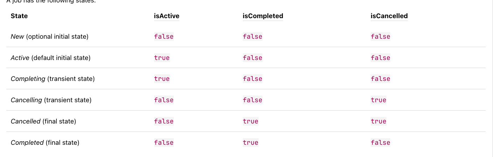

# 코루틴

목표는 코루틴을 이해하는 것이고 여기서 배울 내용은 다음과 같다.

- 코루틴을 뒷받침하는 일시 정지 함수 (suspending function) 의 구조적인 복잡성을 살펴보고

- 동시성 흐름 제어, 코루틴의 생명 주기에 따른 상태 변화, 코루틴 취소나 코루틴의 예외 처리

- 동시성 작업 사이에 통신을 구현하거나 스레드 세이프한 방식으로 변경 가능한 상태를 공유하고 싶을 때 사용하는 채널이나 액터 

- 마지막으로 스레드 새성, 동기화 (synchronization) 과 락 (Lock) 사용 등 자바 동시성 API 를 살펴보자. 

## 코루틴이 필요한 이유  

동시성 연산은 블러킹 연산이므로 문제를 낳는다. 

스레드 개념으로 설명하면 `Thread.sleep()`, `Thread.join()`, `Object.wait()` 등 실행이 끝날 때까지 블락된다. 

스레드를 블락하고 나중에 실행을 재개하면 `context switching` 비용이 든다.

그리고 스레드마다 상당한 양의 시스템 자원을 유지해야 하므로 동시성 스레드를 많이 쓰는 것은 비실용적이다.

그래서 비동기 (asynchronous) 프로그래밍이 등장했고, 블라킹 되는 대신에 다른 작업을 처리하도록 하는 방법이다. 

다만 이 방식은 명령형 제어 흐름이 아니라서 코드 복잡도가 늘어날 수 있다는 점이다. 

코루틴은 동기직 방식의 프로그래밍 작성 방법과 비동기 프로그래밍의 효율성을 합쳤다. 

이런 매커니즘은 실행을 잠시 중단했다가, 다시 재개할 수 있는 일시 중단 가능한 함수 (suspending function) 를 중심으로 이뤄진다.

코루틴이 필요한 이유를 정리하면 이거겠네. 
- 스레드가 차단 당해서 효율이 떨어지는 현상을 막음. 
- 다수의 스레드를 쓸 때 생기는 Context switching 비용을 막을 수 있음. 
- 비동기 프로그래밍을 할 때 생기는 코드 복잡성을 줄일 수 있음. 

### 일시 중지 함수 (suspend function)

이 함수는 함수 본문에 런타임 문맥을 저장하고 이후에 다시 재개할 수 있는 함수다.

````kotlin
suspend fun foo() {
    println("Task started")
    delay(100)
    println("Task finished")
}
````

- `delay` 등으로 블락을 시킨다고 스레드를 교체하지 않는다. 잠시 일시정지 되어서 다른 작업을 수행하다가 이후에 다시 재개된다.

- 주의할 건 일반 함수가 `suspend function` 을 호출하는 걸 금지한다.

동시성 코드는 문맥이 정해진 구체적인 영역에서만 동시성 함수를 호출하는 경우가 많다. 

이런 영역을 제공해주기 위해서 (코투린을 실행하는 여러가지 함수) 코투린 빌더 (coroutine builder) 를 제공해준다.

**(코루틴을 사용하려면 빌더를 통해서 코루틴을 사용할 영역을 만들어줘야 한다.)**

코루틴 빌더는 `CoroutineScope` 인스턴스의 확장 함수로 쓰인다. 

`CoroutineScope` 에 대한 구현 중 가장 기본적인 것으로는 `GlobalScope` 이 있고 이를 사용하면 독립적인 코루틴을 사용할 수 있다.  

그리고 코루틴 빌더의 종류는 `launch`, `async`, `runBlocking()` 이라는 게 있다. 

**(사용할 때는 `CourtineScope` 의 가장 기본 구현체인 `GlobalScope` 의 확장함수로 코루틴 빌더를 선언해서 쓰는데, 그 확장 함수의 종류로 `launch`. `async`, `runBlocking` 이 있다는 뜻.**


### 코루틴 빌더 

먼저 `launch()` 함수부터 보자.

이른 코루틴을 실행 중인 작업 (task) 의 상태를 추적하고 변경할 수 있는 `job` 객체를 돌려준다.

이 함수는 `CoroutineScope.() -> Unit` 타입의 `suspend function` 람다를 받는다.

이 람다가 코루틴의 본문에 해당함. 

예제를 보자.

```kotlin
fun main() {
    val time = currentTimeMillis()
    GlobalScope.launch {
        delay(1000)
        println("Task 1 finished in ${currentTimeMillis() - time} ms")
    }

    GlobalScope.launch {
        delay(1000)
        println("Task 2 finished in ${currentTimeMillis() - time} ms")
    }

    Thread.sleep(2000)
}
```

이 코드를 실행하면 다음과 같은 결과가 나올 것이다. 

- `Task 1 finished in 1056 ms"`
- `Task 2 finished in 1057 ms"`

거의 동시에 끝나는데 이는 병렬로 각각의 코루틴이 실행되었다는 뜻이다. 

다만 실행 순서가 일정하게 보장되지는 않는데 이를 가능하게 하는 방법도 있다. 이후에 설명. 

여기서는 `main` 함수에서 `Thread.sleep()` 을 통해서 스레드 작업을 중지하는데 

**이는 `launch` 코루틴은 백그라운드 스레드 풀에서 받아서 동작하는 데몬 모드 (daemon mode) 이기 때문이다.**

- launch 와 async 모두 백그라운드에서 공유하는 스레드 풀을 이용한다. 물론 blocking 당하지는 않지만.

**`async()` 도 데몬 모드로 동작하는데 `launch` 와의 차이점은 결과를 가지고 오느냐 아니냐의 차이이다. `launch` 는 결과를 가지고 오지 않는다.**

- Unit 타입이었다. 
- 그럼 아까전에 작업의 상태를 추적하고 변경해줄 수 있는 Job 객체를 돌려준다는 의미는 뭐지? 내부 코드를 실행하고 결과를 가져올 순 없지만 Job 의 객체로 추적은 가능하다. 이런 뜻.   

코루틴을 사용할 때 주의할 점은 스레드를 제어하는 함수 `Thread.sleep`, `Thread.join` 과 같은 메소드를 사용하면 안된다는 점이다.

코루틴과 관련된 일시 중지 함수인 `delay` 같은 걸 사용하도록 하자. 

코루틴은 스레드보다 훨씬 가볍다. 스레드처럼 컨택스트 스위칭을 필요로하지도 않는다. 그래서 엄청난 수의 코루틴ㅇ르 동시에 실행하는 것도 가능하다. 

`async` 예제도 한번 보자.

```kotlin
suspend fun main() {
    val message = GlobalScope.async {
        delay(100)
        "abc"
    }

    val count = GlobalScope.async {
        delay(100)
        1 + 2
    }

    val result = message.await().repeat(count.await())
    println(result)
}
```

- `async` 는 호출한 이후에 `Deferred` 라는 객체를 돌려주는데 이는 `job` 의 하위 타입이다. 

- 이 `Deferred` 를 통해서 `await` 함수를 통해 결과를 가지고 올 수 있다. 

- `async` 는 그리고 예외가 발생하면 실패한다.

이제 `runBlocking()` 을 살펴보자.

**이는 백그라운드 스레드풀에서 동작하는게 아니라 현재 스레드에서 코루틴을 실행하도록 한다.** 

**그래서 코루틴을 만들고 코루틴의 실행이 끝날 때까지 블락한다.**

- blocking 의 뜻이 이거였구나. 코루틴을 만들어서 그게 끝날 때까지 블락한다.
  - 이게 스레드 블락도 맞는건가? 맞다. 
  - 현재 스레드에서 코루틴을 실행시키고 그게 끝날 때까지 차단한다.
- `runBlocking()` 과 `coroutineScope()` 의 가장 큰 차이점은 이 함수는 suspend function 이라서 현재 스레드를 블락시키지 않는다고한다.
  - `coroutineScope` 도 자식 코루틴의 실행이 끝날 때까지 완료되지 않는다.
  - `coroutineScope` 을 suspend function + 자식 코루틴의 종료의 보장으로 생각하면 될 듯. (suspend function 이라는 점이 차이가 크다.) 

#### coroutineScope 예제 

```kotlin
fun main() {
    val coroutineScopeTimeInMills = measureTimeMillis {
        demoWithCoroutineScope()
    }

    println("coroutineScopeTimeInMills = $coroutineScopeTimeInMills")
}

val context = Executors.newFixedThreadPool(2).asCoroutineDispatcher()
fun demoWithCoroutineScope() = runBlocking {
    (1..10).forEach {
        launch(context) {
            coroutineScope {
                println("Start No.$it in coroutineScope on ${Thread.currentThread().name}")
                delay(500)
                println("End No.$it in coroutineScope on ${Thread.currentThread().name}")
            }
        }
    }
}

Start No.2 in coroutineScope on pool-1-thread-2
Start No.1 in coroutineScope on pool-1-thread-1
Start No.3 in coroutineScope on pool-1-thread-2
Start No.4 in coroutineScope on pool-1-thread-1
Start No.5 in coroutineScope on pool-1-thread-2
Start No.6 in coroutineScope on pool-1-thread-1
Start No.7 in coroutineScope on pool-1-thread-2
Start No.8 in coroutineScope on pool-1-thread-1
Start No.9 in coroutineScope on pool-1-thread-2
Start No.10 in coroutineScope on pool-1-thread-1
End No.1 in coroutineScope on pool-1-thread-2
End No.2 in coroutineScope on pool-1-thread-1
End No.3 in coroutineScope on pool-1-thread-1
End No.4 in coroutineScope on pool-1-thread-1
End No.5 in coroutineScope on pool-1-thread-2
End No.6 in coroutineScope on pool-1-thread-1
End No.7 in coroutineScope on pool-1-thread-2
End No.8 in coroutineScope on pool-1-thread-1
End No.9 in coroutineScope on pool-1-thread-2
End No.10 in coroutineScope on pool-1-thread-1
coroutineScopeTimeInMills = 581
```

코루틴이 성공적으로 끝나면 suspend function 의 결과가 runBlocking() 의 호출 결과값이 된다. 

코루틴이 취소되면 runBlocking() 은 예외를 던진다.

반면에 블락된 스레드가 인터럽트 되면 코루틴은 예외를 던진다.

**`runBlocking()` 은 블라킹 호출과 넌블라킹 호출의 다리 역할을 해주므로 최상위 빌더로 사용해야 한다.**

## 코루틴 영역과 구조적 동시성

지금까지 살펴본 예제들을 전역 영역 (global scope) 에서만 실행했다. 

global scope 은 코루틴의 라이프 사이클이 어플리케이션 전체의 라이프사이클에 의해서 영향을 받는 영역을 말한다. 

때로는 특정 연산을 수행하는 도중에서만 실행을 바랄 수도 있다. 

그리고 동시성 작업의 부모-자식 관계로 실행이 가능하다. 

- 한 코루틴을 다른 코루틴에서 실행하면 후자가 부모가 된다. 
- 이 경우 자식의 실행이 모두 종료되야지 부모도 종료된다. 
- 이런 기능을 구조적 동시성 (structured concurrency) 라고 한다. 

예제를 보자.

```kotlin
fun main() {
    runBlocking {
        println("Parent task started")

        launch {
            println("task A started")
            delay(200)
            println("task A finished")
        }

        launch {
            println("task B started")
            delay(200)
            println("task B finished")
        }

        delay(100)
        println("Parent task finished")
    }

    println("shutting down...")
}

Parent task started
task A started
task B started
Parent task finished
task A finished
task B finished
shutting down...
```

- 부모가 먼저 끝나더라도 자식이 끝날 때까지 대기된다. 

## 코루틴 문맥 

모든 코루틴은 `CoroutineContext` 를 가진다.

모든 코루틴 클래스는 `CoroutineScope` 를 구현하고  `CoroutineContext` 를 가진다. 

`CoroutineScope` 에서 `CoroutineContext` 에 접근하는게 가능하다.

`CoroutineContext` 는 immutable 하지만 새로운 context 를 가질 수 있다.

- add, remove, merge 등을 통해서.
- element 가 없으면 `EmptyCoroutineContext` 이 된다.

이 context 안에는 여러가지 데이터가 있고, 런타임에 코루틴이 실행되는 방식에 영향을 미친다. 

두 가지 요소에 집중하면 다음과 같다. 

- job: background job. 취소 가능하며 completion 이라는 것으로 끝나는 라이프사이클을 가진다. 
  - 크게 두 가지 구현 요소가 있음.
    - Coroutine job: 
      - 이건 `launch` builder 에 의해서 생성이 가능함. 우리가 정의한 block code 를 실행하는 역할을 한다.
    - Completable Job:
      - `Job()` factory function 으로 생성된다.
- dispatcher: 코루틴이 실행될 스레드 or 스레드 풀을 잡고 있는 관리자. 
  - specific 한 스레드 or 스레드풀로 제한을 걸 수도 있고, 제한없이 실행되도록 할 수도 있다.

- `launch()` 와 `async()` 는 `coroutineContext` 를 파라미터로 선택적으로 받을 수 있다.

요소를 가져올려면 `get()` 메소드나 인덱스 연산자에 키를 넘겨서 가져오면 된다.

```kotlin

 import kotlin.coroutines.coroutineContext
 GlobalScope.launch {
    println("Task is active ${coroutineContext[Job.Key]!!.isActive}")
}
```

기본적으로 `launch()` 나 `async` 와 같은 표준 코루틴 빌더로 만들어진 코루틴은 현재의 context 를 물려받는다. 

필요하면 빌더 함수에 context 를 지정해서 새 문맥을 넘길 수 있다.

코루틴을 실행하는 중간에 `withContext()` 에 새 문맥과 suspend lambda 를 넘겨서 문맥을 전환하는 것도 가능하다. 

- 어떤 코드를 다른 스레드에서 실행하고 싶을 때 유용하다. 
- 스레드 건너뛰기는 dispatcher 를 다룰 떄 살펴보자. 

`CoroutineExceptionHandler` 라는 녀석도 있는데 이건 코루틴에서 Exception 이 발생했을 떄 생기는 처리기이다.

## 코루틴 흐름 제어와 잡 생명 주기 

잡 (Job) 이란 동시성 작업의 라이프 사이클을 표현하는 객체다. 

잡 (Job) 을 통해서 Job 의 상태를 추적할 수 있고, 필요하다면 췻할 수 있다. 

Job 의 상태는 다음과 같다. 



- Active 상태는 작업이 시작되었고 아직 완료나 취소가 되지 않은 상황이다. 잡은 생성되자마자 활성화 상태로 들어간다.
  - Active 상태에서는 job 을 실행시키고 일시정지 하고 다시 재개시킬 수 있다.
  - 그리고 또 다른 Job 을 실행시킬 수 있는데 이 경우에는 부모-자식 관계를 가진다 트리처럼.
  - `children` 프로퍼티를 통해서 완료되지 않은 자식들의 Job 을 알 수 있다.
  - `Active` 상태에서 suspend function 인 람다를 모두 실행시키면 `Completing` (완료중) 상태가 된다.
  - 부모 Job 은 끝났고 자식의 Job 도 모두 끝났다면 `Completed` (완료중) 상태가 된다.  
    - `Completing` 상태는 Job 의 내부적이다. 그래서 밖에서 볼 땐 `Active` 상태가 된다.  

- `launch()` 와 `async()` 는 `CoroutineStart` 타입의 인자를 지정해서 잡의 초기 상태를 선택하는 기능을 제공한다. 
  - `CoroutineStart.DEFAULT`: 잡을 즉시 시작한다. 
  - `CoroutineStart.LAZY`: 잡을 자동으로 시작하지 말라는 뜻이다. 이 경우에는 `New` 상태가 되고 시작을 해야한다.

#### CoroutineStart.LAZY example

````kotlin
@Test
fun `job lazy test`() {
    runBlocking {
        val job = launch(start = CoroutineStart.LAZY) {
            println("Job started")
        }

        delay(100)

        println("Preparing to start...")
        job.start()
    }
}

Preparing to start...
Job started
````

Job 에서 `join()` 메소드를 쓰면 특정 job 이 끝날 때까지 현재 코루틴을 일시 정지 시킬 수 있다. 


#### job join example 

````kotlin
@Test
fun `job join test`() {
    runBlocking {
        val job = coroutineContext[Job.Key]!!

        val jobA = launch { println("This is task A") }
        val jobB = launch { println("This is task B") }

        jobA.join()
        jobB.join()

        println("${job.children.count()} children running")
    }
}

This is task A
This is task B
0 children running
````

## 취소 

job 의 `cancel()` 메소드를 호출하면 job 을 취소할 수 있다. 더이상 필요없는 연산이 있을 때 취소하면 됨. 

cancel 에는 협력이 필요하다. 즉 자기가 취소되었는지 확인하고 이에따라서 적절하게 처리가 되도록 코루틴을 설계해야한다. 

#### 취소되지 않은 코루틴 
````kotlin
suspend fun main() {
    val printer = GlobalScope.launch(Dispatchers.Default) {
        var i = 0
        while (true) {
            println(i++)
        }
    }

    delay(1000)
    printer.cancel()
}
````

#### 취소가 가능한 코루틴 

```kotlin
suspend fun main() {
    val printer = GlobalScope.launch(Dispatchers.Default) {
        var i = 0
        while (isActive) {
            println(i++)
        }
    }

    delay(1000)
    printer.cancel()
    println("canceled")
}
```

상태를 검사하는 방법 말고는 `CancellationException` 을 발생시켜서 취소에 반응할 수 있게 일시 중단 함수를 호출하는 것이다.

한 가지 예시로는 취소의 발생을 감지하는 애가 있고, 감지하면 `CancellationException` 을 내고 resume 되지 않는 것이다. 

이 방법으로는 `yield()` 를 사용하는 방법이 있다. 

- 취소 당하면 현재 스레드에 다른 코루틴을 실행하도록 하는 것.
- suspend 되고 있지 않을 떄에도 자신이 취소당했는지 확인하다. 그래서 취소 당했으면 resume 되지 않는다. 
- 스레드를 양보하는 Thread.yield() 와 유사하다. 

#### yield() 예제 

```kotlin
val printer = GlobalScope.launch(Dispatchers.Default) {
        var i = 0
        while (true) {
            yield()
            println(i++)
        }
    }

    delay(1000)
    printer.cancel()
    println("canceled")
```

부모 코루틴이 취소되면 자동으로 모든 자식의 실행이 취소된다. 

`````kotlin
fun main() {
    runBlocking {
        val parentJob = launch {
            println("Parent started")

            launch {
                println("Child 1 started")
                delay(500)
                println("Child 1 completed")
            }

            launch {
                println("Child 2 started")
                delay(500)
                println("Child 2 completed")
            }

            delay(500)
            println("parent completed")
        }

        delay(100)
        parentJob.cancel()
    }
}
`````

- 부모 job 이 100ms 만에 취소된다. 그 결과 세 잡 중 어느 하나도 완료 상태로 돌아가지 못한다. 
